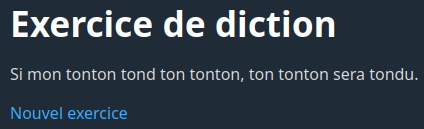
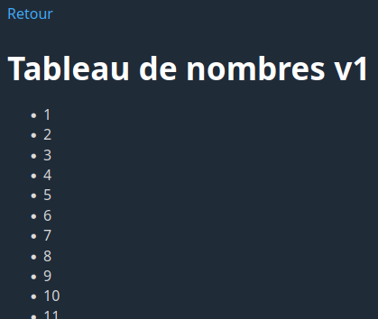
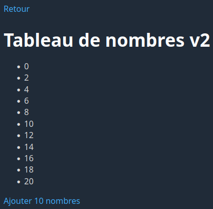
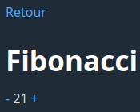
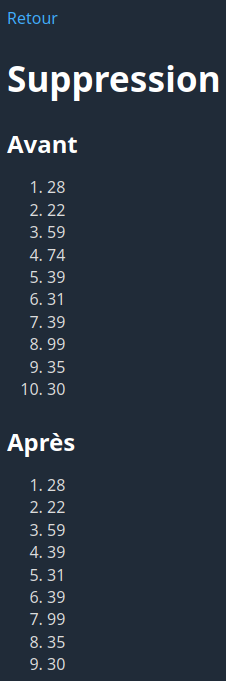

# Laboratoire 03

## Objectif

TODO

## Partie 1

### 1.0 - Création du menu

TODO

### 1.1 - Exercice de diction

Dans le fichier `partie1/diction.php`, créez un tableau contenant les 10 chaînes de caractères suivantes:

* Les chaussettes de l'archiduchesse sont-elles sèches, archi-sèches ?
* Ton thé t'a-t-il ôté ta toux ?
* Si mon tonton tond ton tonton, ton tonton sera tondu.
* Cinq chiens chassent dans un champ.
* Un pâtissier qui pâtissait chez un tapissier qui tapissait
* Le ver vert va vers le verre.
* Dors-tu, tortue tordue? Tu dors, tordue tortue.
* Trois tortues trottent sur un trottoir.
* Didon dîna, dit-on, du dos d'un dodu dindon.
* Trois très gros, gras, grands rats gris grattent.

Vous devez faire en sorte d'afficher une phrase au hasard provenant du tableau. Voici à quoi ressemble le résultat attendu:

Voici la ligne de code permettant de sélectionner un élément aléatoire d'un tableau nommé `$tableau`:

`$elementAleatoire = $tableau[array_rand($tableau)];`

### 1.2 - Tableau de nombres v1

Dans le fichier `partie1/nombres1.php`, créez un tableau vide. Ensuite, utilisez une boucle **for** pour ajouter les nombres de 1 à 100 au tableau. Utilisez ensuite **une autre boucle** pour afficher tous les nombres du tableau dans une liste `ul`.

Voici un extrait du résultat attendu:

### 1.3 - Tableau de nombres v2

Dans le fichier `partie1/nombres2.php`, créez un tableau vide. Ensuite, utilisez une boucle **for** qui ajoute les **nombres pairs** de 0 à `$_GET['n']`, avec une valeur par défaut de 20 si `$_GET['n']` est absent ou invalide. Utilisez ensuite **une autre boucle** pour afficher tous les nombres du tableau dans une liste `ul`. À la suite de cette liste, ajoutez un lien permettant de recharger la page avec 10 nombres de plus.

Voici le résultat attendu:

### 1.4 - Fibonacci

Dans le fichier `partie1/fibonacci.php`, créez un tableau vide. Ensuite, utilisez une boucle pour insérer dans ce tableau les 100 premiers nombres de la suite de Fibonacci.

Ensuite, si un paramètre `id` valide est passé dans l'URL, affichez l'élément qui se trouve à l'indice correspondant du tableau, avec deux liens `-` et `+` permettant de décrémenter ou incrémenter `id`. Le `-` ne doit pas s'afficher si l'`id` est 0, et le `+` ne doit pas s'afficher si l'`id` est 99.

Utilisez une valeur d'`id` de 0 si le paramètre est absent ou invalide. Pour être considéré valide, le paramètre doit:

* Être un nombre entier
* Être supérieur ou égal à 0
* Être inférieur à 100

Voici la condition permettant de vérifier si une chaîne de caractères `$s` contient un nombre entier:

`$s == (int)$s`

Voici le résultat attendu pour `id=8`:

### 1.5 - FizzBuzz

Dans le fichier `partie1/fizzbuzz.php`, créez un tableau vide. Ensuite, utilisez une boucle pour ajouter à ce tableau les nombres de 1 à 100.

Ensuite, **à l'aide d'une deuxième boucle**, modifiez le contenu de ce tableau de façon que:

* Les nombres divisibles par 3 soient remplacés par "Fizz"
* Les nombres divisibles par 5 soient remplacés par "Buzz"
* Les nombres divisibles par 3 et 5 soient remplacés par "FizzBuzz"

Finalement, utilisez **une troisième boucle** pour afficher le contenu du tableau.

Voici un extrait du résultat attendu:

### 1.6 - Suppression

Dans le fichier `partie1/suppression.php`, créez un tableau que vous remplirez de 10 nombres aléatoires entre 1 et 100 à l'aide d'une boucle. À l'aide d'**une deuxième boucle**, affichez les 10 nombres du tableau dans un `ol`. Supprimez ensuite **le quatrième élément** du tableau. À l'aide d'**une troisième boucle**, affichez le contenu du tableau de nouveau.

La ligne de code `$nombreAleatoire = rand(1, 100);` permet d'obtenir un nombre aléatoire entre 1 et 100.

Voici un exemple de résultat attendu:

