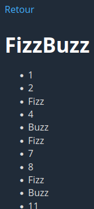
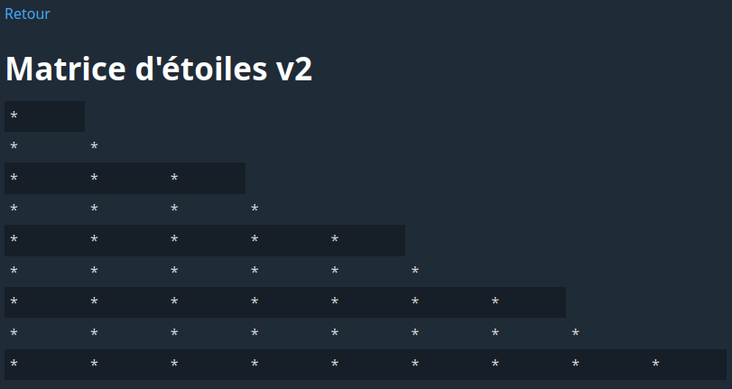
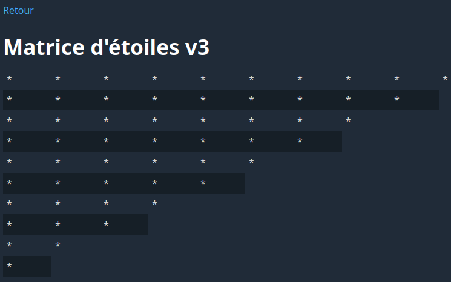
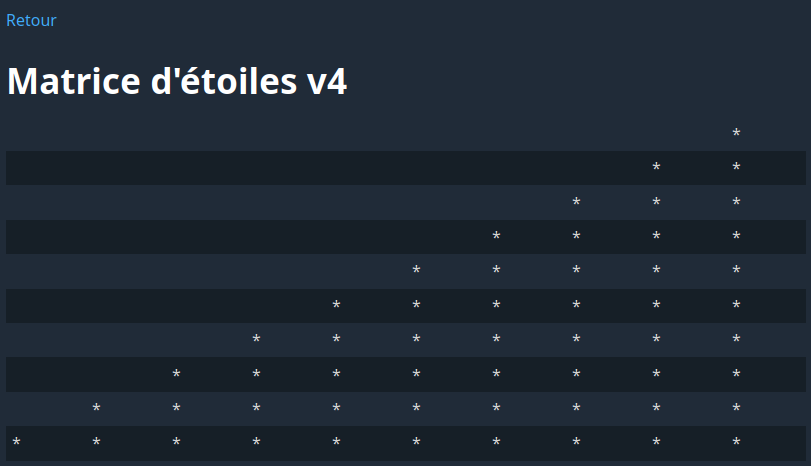
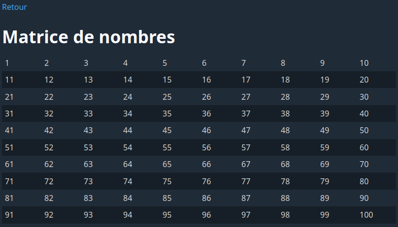

# Laboratoire 03-A

## Objectif

TODO

### 0 - Création du menu

TODO

### 1 - Exercice de diction

Dans le fichier `pages//diction.php`, créez un tableau contenant les 10 chaînes de caractères suivantes:

* Les chaussettes de l'archiduchesse sont-elles sèches, archi-sèches ?
* Ton thé t'a-t-il ôté ta toux ?
* Si mon tonton tond ton tonton, ton tonton sera tondu.
* Cinq chiens chassent dans un champ.
* Un pâtissier qui pâtissait chez un tapissier qui tapissait
* Le ver vert va vers le verre.
* Dors-tu, tortue tordue? Tu dors, tordue tortue.
* Trois tortues trottent sur un trottoir.
* Didon dîna, dit-on, du dos d'un dodu dindon.
* Trois très gros, gras, grands rats gris grattent.

Vous devez faire en sorte d'afficher une phrase au hasard provenant du tableau. Voici à quoi ressemble le résultat attendu:


Voici la ligne de code permettant de sélectionner un élément aléatoire d'un tableau nommé `$tableau`:

`$elementAleatoire = $tableau[array_rand($tableau)];`

### 2 - Tableau de nombres v1

Dans le fichier `pages//nombres1.php`, créez un tableau vide. Ensuite, utilisez une boucle **for** pour ajouter les nombres de 1 à 100 au tableau. Utilisez ensuite **une autre boucle** pour afficher tous les nombres du tableau dans une liste `ul`.

Voici un extrait du résultat attendu:


### 3 - Tableau de nombres v2

Dans le fichier `pages//nombres2.php`, créez un tableau vide. Ensuite, utilisez une boucle **for** qui ajoute les **nombres pairs** de 0 à `$_GET['n']`, avec une valeur par défaut de 20 si `$_GET['n']` est absent ou invalide. Utilisez ensuite **une autre boucle** pour afficher tous les nombres du tableau dans une liste `ul`. À la suite de cette liste, ajoutez un lien permettant de recharger la page avec 10 nombres de plus.

Voici le résultat attendu:


### 4 - Fibonacci

Dans le fichier `pages//fibonacci.php`, créez un tableau vide. Ensuite, utilisez une boucle pour insérer dans ce tableau les 100 premiers nombres de la suite de Fibonacci.

Ensuite, si un paramètre `id` valide est passé dans l'URL, affichez l'élément qui se trouve à l'indice correspondant du tableau, avec deux liens `-` et `+` permettant de décrémenter ou incrémenter `id`. Le `-` ne doit pas s'afficher si l'`id` est 0, et le `+` ne doit pas s'afficher si l'`id` est 99.

Utilisez une valeur d'`id` de 0 si le paramètre est absent ou invalide. Pour être considéré valide, le paramètre doit:

* Être un nombre entier
* Être supérieur ou égal à 0
* Être inférieur à 100

Voici la condition permettant de vérifier si une chaîne de caractères `$s` contient un nombre entier:

`$s == (int)$s`

Voici le résultat attendu pour `id=8`:


### 5 - FizzBuzz

Dans le fichier `pages//fizzbuzz.php`, créez un tableau vide. Ensuite, utilisez une boucle pour ajouter à ce tableau les nombres de 1 à 100.

Ensuite, **à l'aide d'une deuxième boucle**, modifiez le contenu de ce tableau de façon que:

* Les nombres divisibles par 3 soient remplacés par "Fizz"
* Les nombres divisibles par 5 soient remplacés par "Buzz"
* Les nombres divisibles par 3 et 5 soient remplacés par "FizzBuzz"

Finalement, utilisez **une troisième boucle** pour afficher le contenu du tableau.

Voici un extrait du résultat attendu:



### 6 - Suppression

Dans le fichier `pages//suppression.php`, créez un tableau que vous remplirez de 10 nombres aléatoires entre 1 et 100 à l'aide d'une boucle. À l'aide d'**une deuxième boucle**, affichez les 10 nombres du tableau dans un `ol`. Supprimez ensuite **le quatrième élément** du tableau. À l'aide d'**une troisième boucle**, affichez le contenu du tableau de nouveau.

La ligne de code `$nombreAleatoire = rand(1, 100);` permet d'obtenir un nombre aléatoire entre 1 et 100.

Voici un exemple de résultat attendu:


### 7 - Matrice d'étoiles v1

La page **Matrice d'étoiles v1** correspond au fichier `pages/etoiles1.php`. Le code de cette page est déjà complet.

Consultez la page dans votre navigateur. Vous constaterez qu'elle affiche un tableau de 10x10 dont chaque cellule contient le caractère `*`.

Observez ensuite le code PHP de la page. Au début du fichier, vous trouverez l'extrait suivant:

```php
$matrice = [];

for ($i = 0; $i < 10; $i++) {
    $matrice[] = [];
    for ($j = 0; $j < 10; $j++) {
        $matrice[$i][] = '*';
    }
}
```

Comme nous l'avons vu en classe, une matrice (ou tableau à deux dimensions) est dans les faits un tableau de tableaux. L'extrait de code ci-dessus crée une matrice de 10x10 en créant d'abord un tableau vide (`$matrice = []`), auquel il ajoute ensuite 10 lignes (qui sont elles-mêmes des tableaux) à l'aide d'une boucle `for`:

```php
for ($i = 0; $i < 10; $i++) {
    $matrice[] = [];
// (...)
```

Ensuite, la boucle interne ajoute 10 éléments à la ligne courante:

```php
// (...)
    for ($j = 0; $j < 10; $j++) {
        $matrice[$i][] = '*';
    }
}
```

Plus bas dans le fichier, on utilise deux boucles `foreach` imbriquées pour afficher le contenu du tableau PHP dans un tableau HTML:

```php
<table>
    <?php

    foreach ($matrice as $ligne) {
        echo '<tr>';
        foreach ($ligne as $cellule) {
            echo "<td>$cellule</td>";
        }
        echo '</tr>';
    }

    ?>
</table>
```

Dans cet extrait, la boucle externe (`foreach ($matrice as $ligne)`) itère sur les lignes de la matrce, tandis que la boucle interne (`foreach ($ligne as $cellule)`) itère sur les cellules de la ligne courante.

Assurez-vous de bien comprendre les explications ci-dessus avant de poursuivre le laboratoire. Posez vos questions à l'enseignant au besoin.

### 8 - Matrice d'étoiles v2

Ouvrez le fichier `pages/etoile2.php`. Vous trouverez ceci au début du fichier:

```php
<?php

$matrice = [];

// AJOUTEZ VOTRE CODE CI-DESSOUS


// NE MODIFIEZ RIEN APRÈS CETTE LIGNE

?>
```

Entre les deux commentaires, ajoutez les boucles imbriquées nécessaires pour que le contenu de `$matrice` produise l'affichage ci-dessous. **Le code que vous ajoutez ne doit contenir aucun affichage. Du code est déjà présent plus bas dans le fichier pour afficher le contenu de la matrice.**



### 9 - Matrice d'étoiles v3

Ouvrez le fichier `pages/etoiles3.php`.

Entre les deux commentaires en début de fichier, ajoutez les boucles imbriquées nécessaires pour que le contenu de `$matrice` produise l'affichage ci-dessous. Encore une fois, le code que vous ajoutez ne doit contenir aucun affichage.



### 10 - Matrice d'étoiles v4

Ouvrez le fichier `pages/etoiles4.php`.

Entre les deux commentaires en début de fichier, ajoutez les boucles imbriquées nécessaires pour que le contenu de `$matrice` produise l'affichage ci-dessous. Encore une fois, le code que vous ajoutez ne doit contenir aucun affichage.



### 11 - Matrice de nombres

Ouvrez le fichier `pages/matriceNombres.php`.

Entre les deux commentaires en début de fichier, ajoutez les boucles imbriquées nécessaires pour que le contenu de `$matrice` produise l'affichage ci-dessous. Encore une fois, le code que vous ajoutez ne doit contenir aucun affichage.


